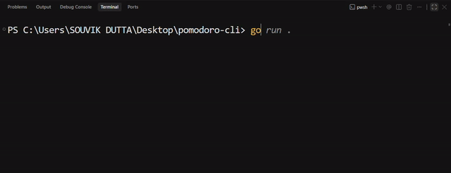

# Pomodoro Timer CLI

A minimalist Pomodoro timer built with **Go**, [Bubble Tea](https://github.com/charmbracelet/bubbletea), and [Lipgloss](https://github.com/charmbracelet/lipgloss). Track your focus sessions directly from the terminal with a clean, styled interface.

## Preview



## Features

* 25-minute Pomodoro countdown
* Real-time countdown powered by Bubble Tea's `tea.Tick`
* Pause and resume functionality
* Minimalist terminal interface styled with Lipgloss
* Focus, paused, and completed timer states
* Lightweight CLI application written in Go

## Tech Stack

| Technology | Purpose                                      |
| ---------- | -------------------------------------------- |
| Go         | Core programming language                    |
| Bubble Tea | Terminal UI and application state management |
| Lipgloss   | Terminal styling and layout                  |

## Prerequisites

* [Go](https://go.dev/dl/) installed on your system
* A terminal that supports ANSI styling

## Installation

### 1. Clone the repository

```bash
git clone https://github.com/s7d4007/Pomodoro-CLI.git
cd Pomodoro-CLI
```

### 2. Install dependencies

```bash
go mod tidy
```

### 3. Run the application

```bash
go run .
```

## Usage

Launch the application from your terminal:

```bash
go run .
```

### Keyboard Controls

| Key        | Action                    |
| ---------- | ------------------------- |
| `Space`  | Pause or resume the timer |
| `Q`      | Quit the application      |
| `Ctrl+C` | Quit the application      |

The timer starts automatically at 25:00 and stops when it reaches 00:00.

## Project Structure

```text
Pomodoro-CLI/
├── assets/
│   └── pomodoro-demo.gif
├── main.go
├── go.mod
├── go.sum
├── README.md
└── LICENSE
```

## Building the Executable

Build a standalone executable for your current operating system:

```bash
go build -o pomodoro
```

On Windows, run the generated executable with:

```powershell
.\pomodoro.exe
```

## Contributing

Contributions, suggestions, and bug reports are welcome.

1. Fork this repository.
2. Create a feature branch.
3. Commit your changes.
4. Push your branch.
5. Open a pull request describing your changes.

For major changes, open an issue first to discuss the proposed improvements.

## Roadmap

Potential future enhancements:

* Configurable focus duration
* Short and long break sessions
* Session counter
* Sound notifications
* Daily focus statistics

## License

This project is licensed under the [MIT License](LICENSE).

You are free to use, modify, and distribute this project in accordance with the license terms.
